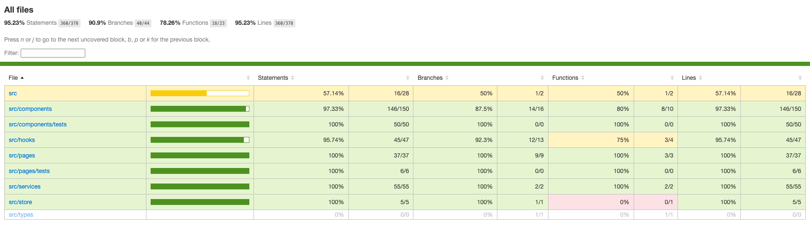

# CS Project

This a CS Project. [Go to Action!](https://cs-project-two.vercel.app/)

## Stack

- [**Vite.js**](https://vitejs.dev/) - Next Generation Frontend Tooling
- [**Typescript**](https://www.typescriptlang.org/) - JavaScript with syntax for types.
- [**Chakra UI**](https://chakra-ui.com/) - Chakra UI: Simple, Modular and Accessible UI Components for your React Applications.
- [**React Router DOM**](https://reactrouter.com/) - A JavaScript framework that lets us handle client and server-side routing in React applications.
- [**Zustand**](https://zustand-demo.pmnd.rs/) - A small, fast, and scalable bearbones state management solution.


## Technical Decisions
   - Zustand was used as a State global manager because in the problem we didn't have a backend to persite the data, so to share info between the Home Dynamic Form and Confirmation page, we created useConfirmationDataStore a Zustand store, in this way we have this info without the use of a ContextProvider, only as a Custom hook.


## Files Structure

```
├── node_modules (.gitignore)
├── public
├── src
│   ├── assets
│   ├── components
│   │   ├── ConfirmNotData.tsx
│   │   ├── DynamicButton.tsx
│   │   ├── DynamicCheckbox.tsx
│   │   ├── DynamicForm.tsx
│   │   ├── DynamicInput.tsx
│   │   ├── DynamicSelect.tsx
│   │   ├── HomeLoading.tsx
│   ├── hooks
│   │   └── useFormConfig.tsx
│   │   ├── ...
│   ├── pages
│   │   ├── ConfirmationPage.tsx
│   │   └── HomePage.tsx
│   ├── services
│   │   └── api.ts
│   ├── store
│   │   └── useConfirmationDataStore.ts
│   └── App.css
│   └── App.tsx
│   └── index.css
│   └── main.tsx
│   └── vite-env.d.ts
├── .gitignore
├── eslint.config.js
├── index.html
└── package-lock.json
├── package.json
└── README.md
└── tsconfig.app.json
└── tsconfig.json
└── tsconfig.node.json
└── vite.config.ts
├── vitest.config.ts
```

## Prerequisites:

- [Node.js 18+](https://nodejs.org/en/).
- [Git](https://git-scm.com/).

1. [Fork](https://github.com/davilapa/cs-project/fork) or [Clone](https://github.com/davilapa/cs-project)
   this repository and clone it locally

```bash
git clone git@github.com:<your_username>/pokedex-app.git
```

2. Install dependencies:

```bash
npm install
```

3. run the development server:

```bash
npm run dev
```

Open [http://localhost:5173](http://localhost:5173) with your browser to see the result.

### Coverage
